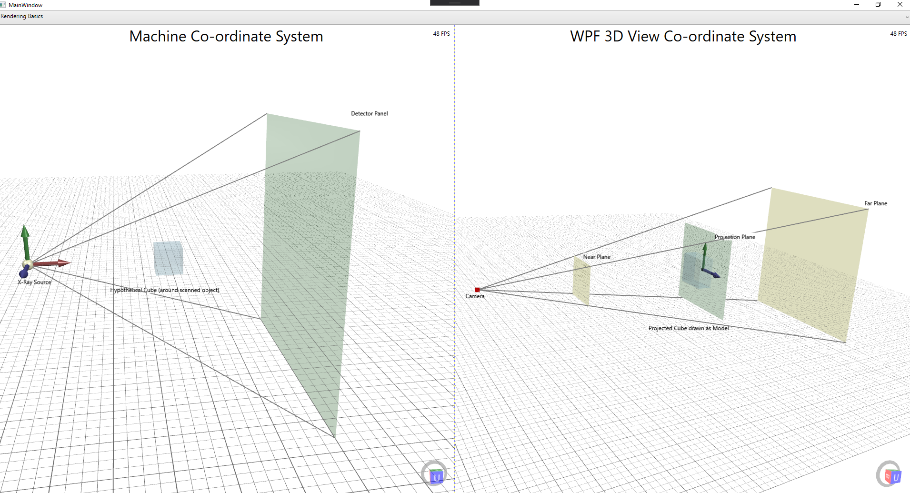
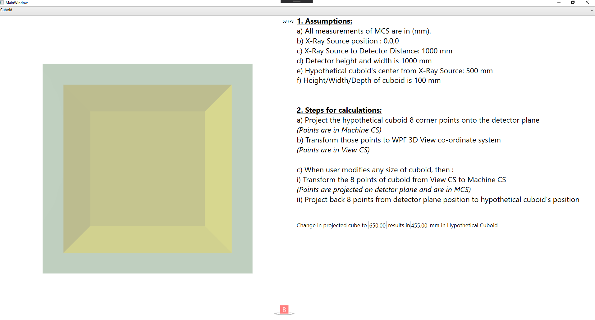

# X-Ray-Reconstruction-Cuboid
Small repository which includes logic and visualization for projecting a cuboid between x-ray source and detector plane onto the DetectorPlane position and draw the detector image and cuboid on a single viewport. Also handles changes by user on projected cuboid &amp; handles back projection to original cuboid.

## Overview

